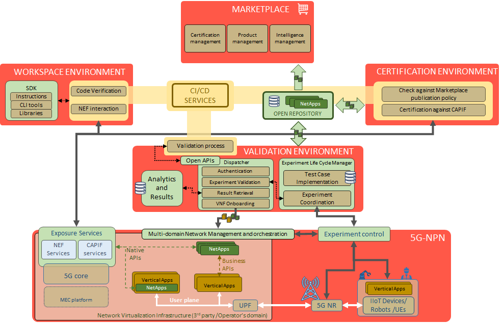

# EVOLVED-5G overview
The EVOLVED-5G architecture is built around four major environments: Workspace, Validation, Certification and Marketplace.



Following the numbers from the image, four environments are described starting from the Workspace.
### Workspace Environment

The workspace is one of the core architectural environments of the NetApsds ecosystem. The main objective of the Workspace environment is to provide developers with the necessary software tools and instructions for NetApp development while making this process easy, quick and convenient. To do so, it goes through two phases; namely, the NetApp development and verification phases. 

The Development phase is one of the Workspace main functional blocks. The objective of the Development phase is to help developers to develop the NetApp by providing the necessary means, e.g., within the scope of the SDK tools, the developers will be provided with some libraries to enhance the NetApp with the 5G capabilities which in following phases will be tested. 

The purpose of the Development phase is to provide a fully NetApp with a readiness level to besent to the next phase which will be verification.

The Verification phase is formed by the CI/CD Services and the Emulation Environment
functional blocks. The CI/CD services is in charge to run the pipeline; the Emulation Environment is responsible of performing the defined tests for verification.

The objective of the Verification phase is to guarantee that the NetApp is able to operate correctly in a synthetic environment before releasing it to the Validation environment where functional and non-functional tests are provided. During the verification phase only the NetApp itself is considered and not any potential vApp that could be associated to it.

The Workspace environment also provides developers with the appropriate code storage repository
(GitHub) where tools and instructions are stored as well as the code of the NetApps generated during the development phase, and an artifact repository (Open Repository) and a Docker Registry where the binaries coming from the verification phase will be stored.

### Validation Environment

The Validation environment is the functional block that is in charge of the validation of the NetApp. The goal of the Validation environment is to provide the tools and methodology required for the execution of the validation process. The validation process includes the evaluation of the functionality of the NetApps when they are used along with the vertical App (vApp) on the platform (Athens or Malaga )as well as performance tests.

Within the lifecycle of a NetApp, the Validation environment is used after a successful
completion of the verification process, i.e., only after a prove that the NetApp is functional and compatible with the 5G APIs. Similarly, the successful completion of the validation process is a pre-condition for a NetApp to enter the certification process.

### Certification Environment

```diff
- Work in progress
```

### Marketplace Environment

```diff
- Work in progress
```

## Main features

The EVOLVED-5G facility provides different tools/software to allow the lifecycle of a NetApp. Such software are list as follows:

### SDK

The Software Development Kit (SDK) is one of the functional blocks of the Workspace, which provides a set of tools to facilitate the development of NetApps for developers. The tools integrated in the SDK are the following: 

* A CLI tool, which allows the developer to create the repository for each NetApp from an automated NetApp template. Implement 5G Core libraries and launch pipelines for verification purposes.
* NetApp Template, where the developer can find the structure of folders and files that compose the NetApp (code). This template is mainly made up of another tool called cookicutter
* SDK Libraries, that facilitate the interaction of NetApps developers with either our NEF emulator or a real Core 5G, by providing an abstraction towards the use of APIs.

###  NetApp Template

```diff
- Work in progress
```

### NEF emulator  

```diff
- Work in progress
```

### CAPIF tool

```diff
- Work in progress
```

### Dummy NetApp

```diff
- Work in progress
```
