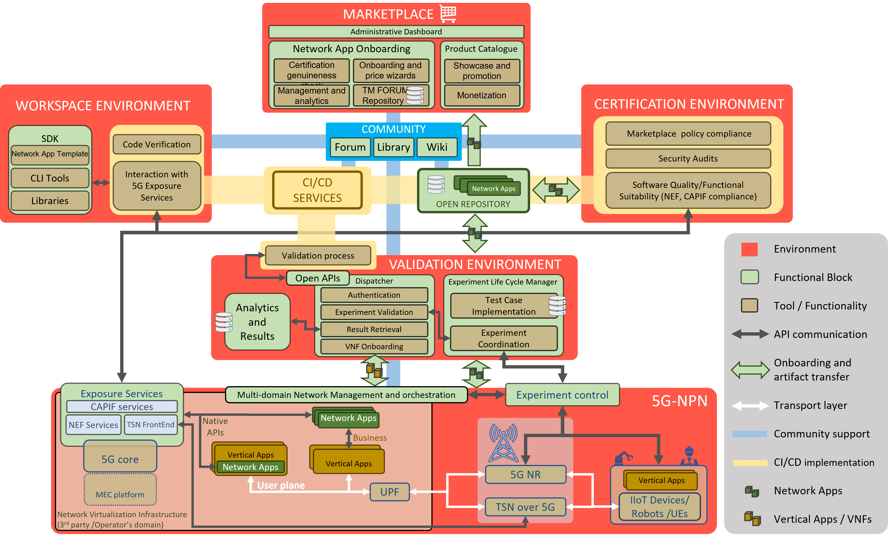

# EVOLVED-5G overview
The EVOLVED-5G architecture is built around four major environments: Workspace, Validation, Certification and Marketplace.



Following the numbers from the image, four environments are described starting from the Workspace.
### Workspace Environment

```diff
- Work in progress
```
### Validation Environment

```diff
- Work in progress
```

### Certification Environment

```diff
- Work in progress
```

### Marketplace Environment

```diff
- Work in progress
```

## Main features

The EVOLVED-5G facility provides different tools/software to allow the lifecycle of a NetApp. Such software are list as follows:

### SDK-CLI

```diff
- Work in progress
```

### Template

```diff
- Work in progress
```

### CAPIF API services

```diff
- Work in progress
```

### NEF emulator  

```diff
- Work in progress
```
